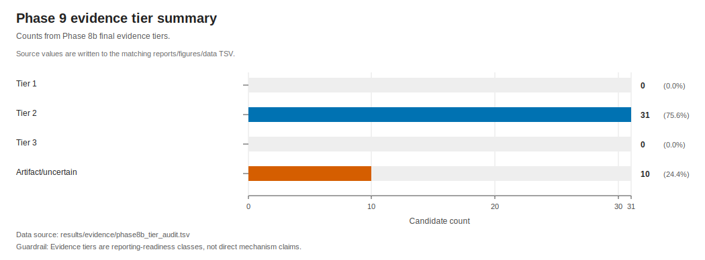
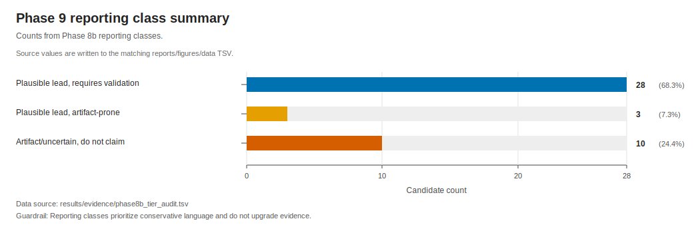
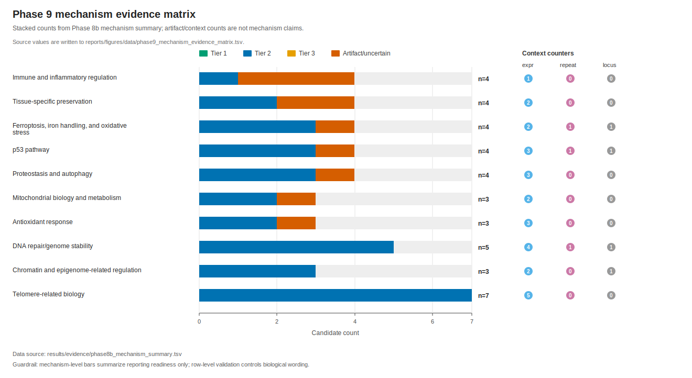
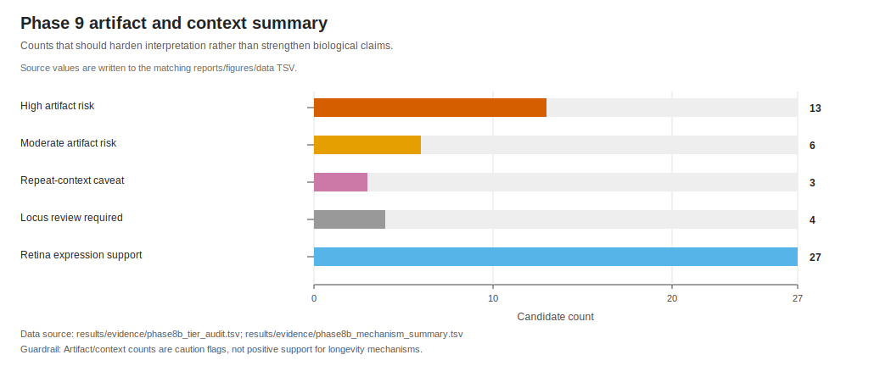

# Phase 9 Integrated Evidence Report

Phase 9 converts the final Phase 8b evidence audit into a report and figures. It does not change evidence tiers or create new biological claims.

## Primary Inputs

- `results/evidence/phase8b_tier_audit.tsv`
- `results/evidence/phase8b_mechanism_summary.tsv`
- `results/evidence/phase8b_final_integrated_evidence.tsv`
- `docs/claims_register.md`

## Method Rationale

The report uses deterministic categorical summaries rather than statistical testing or weighted scoring. Phase 8b rows are evidence-audit classifications, not replicate-level measurements with a sampling model. TSV-backed SVG figures are used because they are inspectable, portable, and sufficient for evidence-tier and artifact-risk summaries. Figures use a colorblind-safe palette, explicit count axes, embedded title/description metadata, and source/guardrail captions so interpretation remains traceable.

## Executive Summary

- Candidates audited: 41
- Final Tier 1 rows: 0
- Final Tier 2 rows: 31
- Artifact/uncertain rows: 10
- Plausible leads requiring validation: 28
- Plausible leads with artifact-prone status: 3

## Key Findings

- **Does any candidate meet current Tier 1 criteria?** No current candidate reaches Tier 1 in Phase 8b (0 rows). Guardrail: Report this as current evidence status, not as a statement about biology.
- **What is plausible but incomplete?** 31 rows remain Tier 2; 28 are plausible leads requiring validation. Guardrail: Tier 2 supports conservative candidate language only.
- **Which plausible leads are artifact-prone?** FTH1B, H1F0, RAD51 Guardrail: Artifact-prone leads require locus, repeat, paralog, and cross-resource validation before stronger wording.
- **What should not be claimed biologically?** 10 rows remain artifact/uncertain: FTL, HSPA8, KEAP1, LRRFIP1, PARK2, RH1, SAG, TLR4, TNF, TP53. Guardrail: Do not turn artifact/uncertain rows into mechanism statements.
- **How should expression support be interpreted?** 27 candidate rows carry cautious retina-specific expression support. Guardrail: Retina expression support is tissue-specific and not differential expression.

## Figures

### Evidence Tier Summary

### Reporting Class Summary

### Mechanism Evidence Matrix

### Artifact Context Summary

## Mechanism Summary

| mechanism | candidate_count | tier2_count | artifact_uncertain_count | artifact_prone_count | expression_supported_count | repeat_context_caveat_count | locus_review_required_count |
| --- | --- | --- | --- | --- | --- | --- | --- |
| Antioxidant response | 3 | 2 | 1 | 1 | 3 | 0 | 0 |
| Chromatin and epigenome-related regulation | 3 | 3 | 0 | 1 | 2 | 0 | 1 |
| DNA repair/genome stability | 5 | 5 | 0 | 1 | 4 | 1 | 1 |
| Ferroptosis, iron handling, and oxidative stress | 4 | 3 | 1 | 2 | 2 | 1 | 1 |
| Immune and inflammatory regulation | 4 | 1 | 3 | 3 | 1 | 0 | 0 |
| Mitochondrial biology and metabolism | 3 | 2 | 1 | 1 | 2 | 0 | 0 |
| Proteostasis and autophagy | 4 | 3 | 1 | 1 | 3 | 0 | 0 |
| Telomere-related biology | 7 | 7 | 0 | 0 | 5 | 0 | 0 |
| Tissue-specific preservation | 4 | 2 | 2 | 2 | 2 | 0 | 0 |
| p53 pathway | 4 | 3 | 1 | 1 | 3 | 1 | 1 |

## High-Priority Candidate Guardrails

| gene_symbol | mechanism | phase8b_final_evidence_tier | phase8b_reporting_class | artifact_risk_level | major_caveats |
| --- | --- | --- | --- | --- | --- |
| FTH1B | Ferroptosis, iron handling, and oxidative stress | Tier 2 | PLAUSIBLE_LEAD_ARTIFACT_PRONE | high | high_artifact_risk;copy_number_not_validated;high_repeat_context_artifact_risk;NO_POSITIVE_EXPRESSION_SUPPORT_USED;cross_resource_validation_required |
| H1F0 | Chromatin and epigenome-related regulation | Tier 2 | PLAUSIBLE_LEAD_ARTIFACT_PRONE | high | high_artifact_risk;copy_number_not_validated;NO_POSITIVE_EXPRESSION_SUPPORT_USED;cross_resource_validation_required |
| RAD51 | DNA repair/genome stability | Tier 2 | PLAUSIBLE_LEAD_ARTIFACT_PRONE | high | high_artifact_risk;copy_number_not_validated;high_repeat_context_artifact_risk;NO_POSITIVE_EXPRESSION_SUPPORT_USED;cross_resource_validation_required |
| TP53 | p53 pathway | Artifact/uncertain | ARTIFACT_UNCERTAIN_DO_NOT_CLAIM_BIOLOGICALLY | high | high_artifact_risk;high_repeat_context_artifact_risk;NO_POSITIVE_EXPRESSION_SUPPORT_USED;cross_resource_validation_required |

## Interpretation Boundaries

- This report can classify current rows as robust-ready, plausible, exploratory, or artifact-prone under the workflow criteria; in the current Phase 8b output, no row is robust-ready.
- This report cannot infer pathway state, validated duplication, functional advantage, telomere length, organism-wide aging mechanism, causation, or human translational relevance.
- Repeat context is artifact/context evidence only.
- Retina expression support is tissue-specific and does not substitute for locus validation.
- `TP53` remains artifact/uncertain in the current audit and should be treated as a p53-family validation problem, not a mechanism result.

## Required Follow-Up

- Resolve high-priority candidate loci with cross-resource support where feasible.
- Add independent domain/locus validation for candidates that would otherwise be used in duplication wording.
- Treat expression support as retina-specific until additional tissues and metadata are available.
- Keep every biological statement traceable to the claims register and Phase 8b row-level audit.
